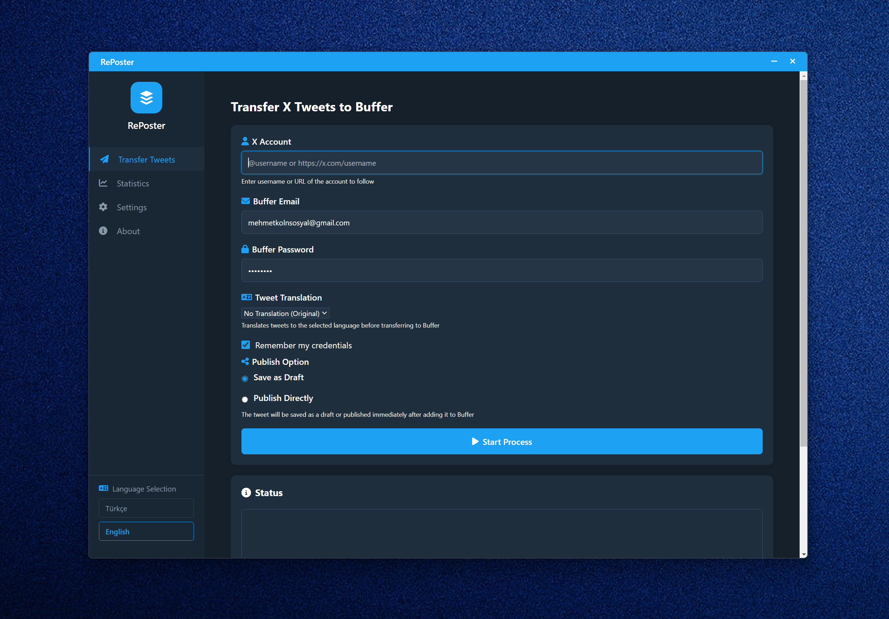
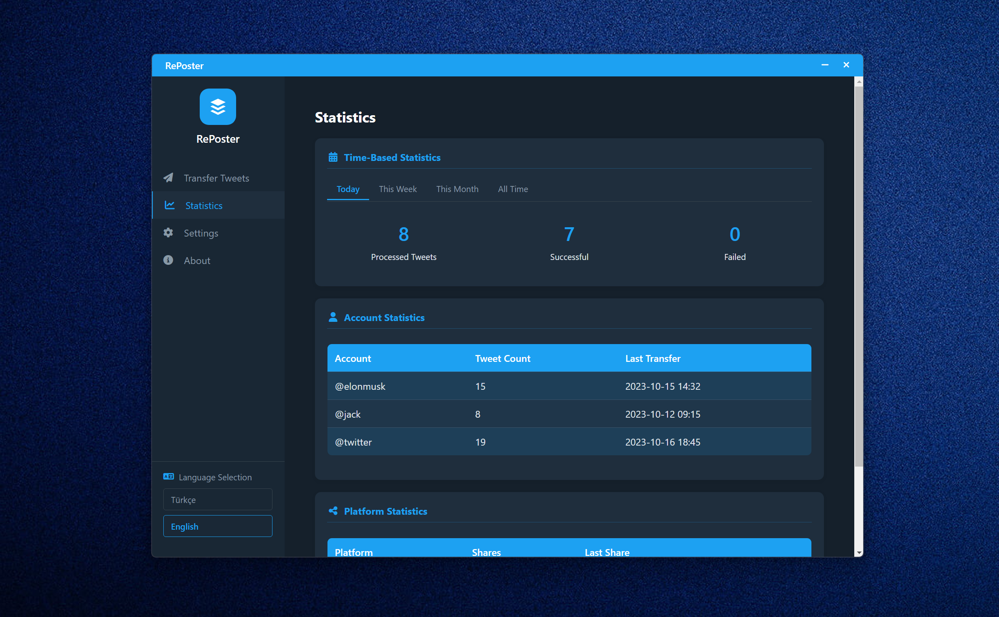
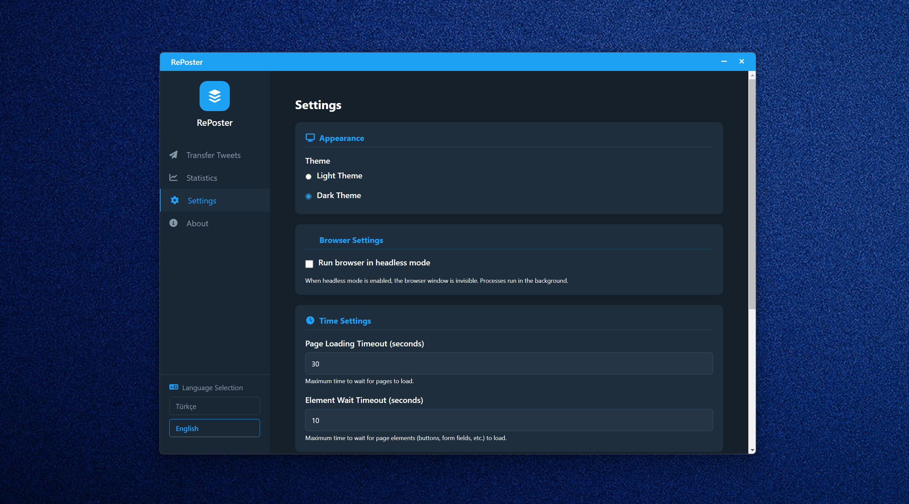

# RePoster

An Electron-based desktop application that transfers tweets from X (Twitter) to Buffer platform. Simplify your social media management.

## Features

- **Tweet Transfer**: Automatically transfer the latest tweets from X (Twitter) accounts to Buffer
- **Multi-language Support**: Turkish and English interface
- **Tweet Translation**: Translate tweets to different languages (TR, EN, FR, DE, RU, ES)
- **Sharing Options**: Save as draft or publish directly to Buffer
- **Dark/Light Theme**: Theme options that reduce eye strain
- **Statistics**: View operation statistics and filter by time periods

## Screenshots

### Transfer Tweets Page


### Statistics Page


### Settings Page


## Installation

### Prerequisites

- Node.js (v14 or higher)
- npm (v6 or higher)

### Steps

```bash
# Clone the repository
git clone https://github.com/username/RePoster.git

# Navigate to the project folder
cd RePoster

# Install dependencies
npm install

# Start the application
npm start
```

## Usage

1. Enter X (Twitter) account URL or username
2. Enter your Buffer account credentials
3. Optionally select a tweet translation option
4. Select sharing option (draft or direct publishing)
5. Click "Start Process" button
6. Monitor progress in the status section

## Technologies

- Electron
- JavaScript
- HTML/CSS
- Puppeteer (web automation)

## Customization

The application can be customized from the settings section:
- Theme selection (Light/Dark)
- Browser visibility (Headless mode)
- Timeout settings
- Buffer publishing options

## Statistics

In the statistics page, you can monitor:
- Time-based operation counts (today, this week, this month, all time)
- Account-based statistics
- Platform sharing data

## License

This project is licensed under the [MIT License](LICENSE).

## Contact

Email: yunuskolbasar@gmail.com

---

**Note**: This application is not officially affiliated with X (Twitter) or Buffer. 